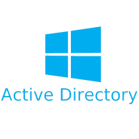

# Course of Migration Windows AD to Zentyal


<p align="center">

</p>

Course about Active Directory using Windows Server 2008 R2 and Zentyal Linux.

Creator: Luciano Rodrigues

## Commands for Windows Server

```bash
# Add/remove Domain Controllers
dcpromo

# Populate AD using script PowerShell
Set-ExecutionPolicy Unrestricted
.\import.ps1

# Check IPs of domain
nslookup mylab.lan

# Get list of all Domain Controllers
nltest /dclist:mylab.lan

# Query for DC with FSMO
netdom query fsmo

# Show info about DC
nltest /dsgetdc:mylab.lan

# Get replicated data and send to clipboard
repadmin /showrepl | clip

# Replicate database from server02 to server01
repadmin /replicate server01 server02 YOUR-DATA /force

# Replicate database from server01 to server02
repadmin /replicate server02 server01 YOUR-DATA /force /full

# Use script replicate-data.bat for manual replication

# Register new dll on windows
regsvr32 schmmgmt.dll

# Microsoft Management Console
mmc
```

## Commands for Linux Zentyal

```bash
# Show info about DC
samba-tool domain info 127.0.0.1

# Check database and fix erros
samba-tool dbcheck --cross-ncs --yes --fix -v
samba-tool dbcheck --cross-ncs --yes

# List all users
samba-tool user list

# Query for DC with FSMO
samba-tool fsmo show

# Show zones of DNS
samba-tool dns zonelist 127.0.0.1 -P

# Conect and download folders from a shared folder
smbclient //server01/sysvol -U administrator%Password
smb> cd mylab.lan
smb> recurse
smb> prompt
smb> mget scripts
smb> mget Policies

# Reset sysvol permissions
samba-tool ntacl sysvolreset
samba-tool ntacl sysvolcheck
```

## Refenreces

[Playlist from SysAdminBr Channel](https://youtube.com/playlist?list=PLFajyb7NamFDqLmrUIddr_euDkRcWMgQ9&si=DSh5C1VDw9WLha-j)
